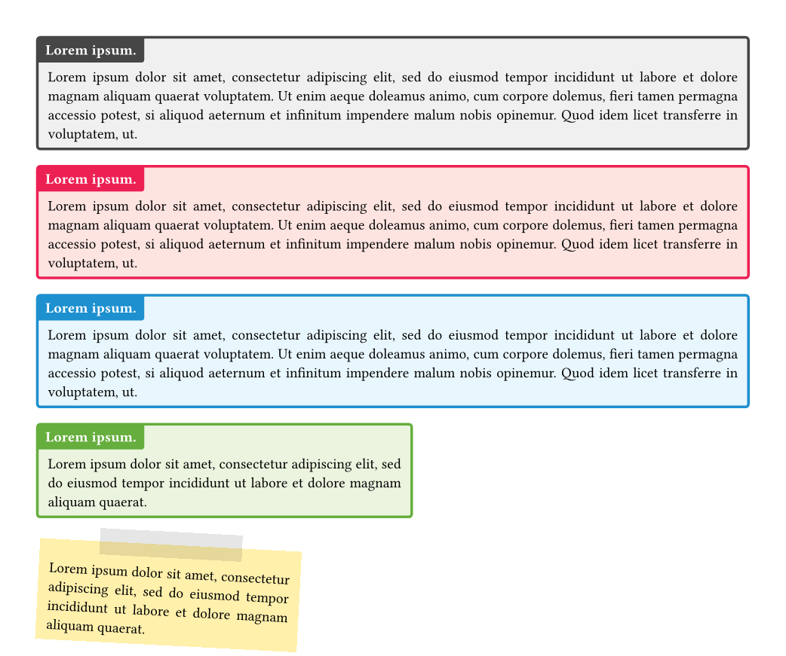

# typst-boxes

Colorful boxes in [typst](https://github.com/typst/typst).
Copy and import the [typst-boxes.typ](typst-boxes.typ) file to use in your own projects.


Current features include:
- a colorful box is in four different colors (black, red, blue, green)
- a rotateable stickynote

## Examples


### Code
```
#colorbox(title: lorem(2))[#lorem(50)]

#colorbox(
  title: lorem(2),
  color: "red")[
    #lorem(50)
]

#colorbox(
  title: lorem(2),
  color: "blue")[
    #lorem(50)
]

#colorbox(
  title: lorem(2),
  color: "green",
  width: 10cm)[
    #lorem(20)
]

#v(8pt)
#stickybox(rotation: 3deg, width: 7cm)[#lorem(20)]
```
